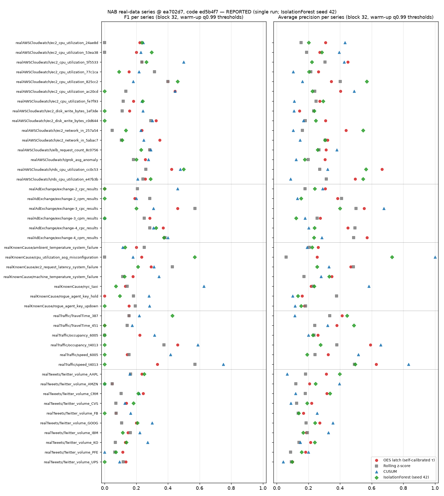

# oes512q-latch

Standard-library Python research prototype for the **OES-32 / OES-512 classical residual latch**, with an **optional amplitude-encoded feature vector** (5 qubits for OES-32, 9 for OES-512) and diagonal block observables $S_i = I - 2\Pi_i$ for comparison. The classical latch always runs first; the encoding is a software sidecar.

**In plain English:** a transparent, fixed-weight score that flags which 32-sample blocks of a signal look anomalous, benchmarked against standard detectors on public NAB data (it ranks blocks best by average precision but loses to CUSUM on F1). **Quick start** (Python ≥ 3.10, standard library only): `git clone https://github.com/sparkainlp-x/oes512q-latch.git && cd oes512q-latch && python oes512_hilbert_hook.py`; tests and the benchmark are in [Install, run and test](#install-run-and-test).

[](https://github.com/sparkainlp-x/oes512q-latch/actions/workflows/ci.yml)
[](https://www.gnu.org/licenses/agpl-3.0)
[](#what-it-is-not)
[](#evidence-tags)
[](https://doi.org/10.5281/zenodo.22998570)

## What it is

- **Classical block latch.** A 32-channel block $r$ gets a weighted score $S$ and latches when $S \ge \tau$ (default $\tau = 0.50$).
- **OES-512 coarse syndrome.** 512 channels = 16 contiguous blocks of 32; one latch bit per block gives a 16-bit syndrome. A frame is *admitted* iff the syndrome weight is 0.
- **Optional feature encode.** After the latch, the real vector is L2-normalized into a $2^5 = 32$ or $2^9 = 512$ amplitude vector (a classical list of complex numbers).
- **Block observables.** Diagonal projectors $\Pi_i$ onto block $i$, observables $S_i = I - 2\Pi_i$, Pauli-Z diagonals $Z_0 \dots Z_8$, and a "mass-fire" comparison against the classical syndrome.
- **Self-calibrated τ (v2, optional).** `oes_calibration.calibrate_tau` sets τ per series from a warm-up segment (99th percentile of block scores on robust-scaled residuals), without labels. The fixed τ = 0.50 stays the default. See [OES latch v2](#oes-latch-v2-weighted-score--self-calibrated-τ-default-fixed-τ050-retained).
- **Fail closed.** Wrong lengths, non-finite (NaN/inf) or non-real values, and invalid thresholds raise `ValueError` / `TypeError` instead of producing a latch bit.

## What it is NOT

- **Not** a stabilizer quantum error-correcting code. The 16 block observables are not 16 independent Pauli stabilizers; 9 qubits admit at most 9 independent commuting generators.
- **Not** a 32-qubit or 512-qubit Hilbert space. 32 and 512 are the number of *amplitudes* ($2^5$, $2^9$), not qubits.
- **Not** run on quantum hardware, a QPU, IQM or any cloud quantum service. Everything runs as plain Python.
- **Not** the normative OES-32 residual. That is [`oes32-residual`](https://github.com/sparkainlp-x/oes32-residual) (see [Relationship](#relationship-to-oes32-residual-adr-001-and-oes512-residual)).
- **Not** field telemetry, a certified safety system, a medical device or a commercial product.

## Architecture

```text
x ∈ R^512 ──► validate (length, finite, real) ──► split into 16 × 32 blocks
                                                          │
                                   ┌──────────────────────┴───────────────────────┐
                                   ▼  (1) classical latch — authoritative         ▼  (2) optional sidecar
                         S_b = 0.45·peak + 0.35·RMS + 0.20·mean|x|        ψ = x / ‖x‖₂  (9-qubit amplitudes)
                         s_b = [S_b ≥ τ]  →  16-bit syndrome              block masses M_b, ⟨S_i⟩, ⟨Z_q⟩
                         admitted ⇔ Σ s_b = 0                             mass-fire m_b = [M_b ≥ 0.50]
```

| File | Role |
|---|---|
| [`oes32_hilbert_hook.py`](oes32_hilbert_hook.py) | OES-32 block score, latch, input validation, optional 5-qubit amplitude encode |
| [`oes512_hilbert_hook.py`](oes512_hilbert_hook.py) | 16 × 32 split, 16-bit coarse syndrome, `admitted()`, optional 9-qubit encode, synthetic frames |
| [`oes_calibration.py`](oes_calibration.py) | OES latch v2: `calibrate_tau` → frozen `TauCalibration`, calibrated latch / syndrome, `robust_scale`, `quantile_linear` (stdlib) |
| [`oes512_stabilizers.py`](oes512_stabilizers.py) | Block projectors $\Pi_i$, $S_i = I - 2\Pi_i$, Pauli-Z diagonals, block masses, mass-fire comparison |
| [`benchmarks/`](benchmarks) | NAB download + SHA-256 manifest, block-level benchmark harness, bit-identical vectorised latch score, NAB-scorer bridge, chart, `results.json` |
| [`tests/`](tests) | pytest suite: known values, τ boundary, validation, encode, projector algebra, seeded property test |

## Math

**Block score** for a block $r \in \mathbb{R}^{32}$:

$$S(r) = 0.45 \max_j |r_j| + 0.35 \sqrt{\tfrac{1}{32}\sum_j r_j^2} + 0.20 \cdot \tfrac{1}{32}\sum_j |r_j|$$

(the RMS uses $r_j^2 = |r_j|^2$, so it is the RMS of the absolute residual). Weights sum to 1, so a constant block $|r_j| = c$ scores exactly $S = c$.

**Latch and syndrome:** $s_b = \mathbf{1}[S(x_b) \ge \tau]$ for $b = 0,\dots,15$, where $x_b = (x_{32b}, \dots, x_{32b+31})$. Equality latches. $\text{admitted}(x) \iff \sum_b s_b = 0$.

**Feature encode:** $\psi_k = x_k / \lVert x \rVert_2$ for $k = 0,\dots,511$ (zero vector → $\psi = e_0$), so $\sum_k |\psi_k|^2 = 1$.

**Index split.** With $k = \sum_{q=0}^{8} k_q 2^q$, the block id is $b = \lfloor k/32 \rfloor = k \gg 5$, so qubits $0$–$4$ are the in-block *payload* and qubits $5$–$8$ are the block *address* ($b_t = k_{5+t}$).

**Block observables:** $\Pi_i = \sum_{k:\,\lfloor k/32 \rfloor = i} |k\rangle\langle k|$, $S_i = I - 2\Pi_i$, $M_i = \langle\psi|\Pi_i|\psi\rangle$, $\langle S_i \rangle = 1 - 2M_i$, $\sum_i M_i = 1$.

**Address Z-expectations** are the single-bit marginals of the block-mass distribution: $\langle Z_{5+t}\rangle = \sum_b M_b (-1)^{b_t}$. The four values $\langle Z_5\rangle..\langle Z_8\rangle$ do **not** determine the 16 masses on their own (e.g. uniform mass and mass split between blocks 0 and 15 both give all zeros); the full set of 16 address Z-string correlators $\langle \prod_{t \in T} Z_{5+t} \rangle$ does, via the inverse Walsh–Hadamard transform. Both facts are tested.

## OES latch v2: weighted score + self-calibrated τ (default fixed τ=0.50 retained)

Version 0.2.0 adds an **optional** per-series threshold, calibrated without labels, in [`oes_calibration.py`](oes_calibration.py) (standard library only). The score $S$, the weights, the $S \ge \tau$ rule (equality latches) and the 16 × 32 layout are unchanged. `latch_bit`, `coarse_syndrome` and every other existing function keep the fixed default **τ = 0.50**, so v1 behaviour is untouched. Evidence tag: **TARGET** for the extended contract here. The rule is **REPORTED** in the benchmark below, which calls this exact code.

**Rule** (`calibrate_tau`, method `warmup-quantile-type7`):

1. Residual per warm-up block: $x - \text{ref}$. The reference is `None` (blocks are already residuals), one real, or one real / 32-vector per block, e.g. a causal trailing median.
2. Robust scale $\sigma$ over all warm-up residual values: $1.4826\cdot\text{MAD}$. If MAD = 0, use $\sqrt{\pi/2}\cdot$ the mean absolute deviation from the median (computed with `math.fsum`). If that is also 0, calibration fails.
3. Score each warm-up block on $r = (x - \text{ref})/\sigma$ with `block_score`.
4. $\tau$ = the `quantile` (default 0.99) of those scores, using Hyndman–Fan type 7 linear interpolation. `quantile_linear` performs the same floating-point operations as numpy's default `np.quantile`, and a test checks they are bit-identical.

**Fail closed.** `CalibrationError` (a `ValueError`) is raised for fewer than `min_blocks` (default 4) warm-up blocks or zero spread. `ValueError` / `TypeError` is raised for wrong block length, non-finite or non-real values or references, a quantile outside the open interval (0, 1), a non-positive or non-finite fixed scale, and a non-finite or negative τ. Calibration is deterministic and does not depend on block order. **Labels are never an input.** The signature has no label argument, and a test shows that scrambling the labels leaves every threshold unchanged.

**API**

| Function / object | Purpose |
|---|---|
| `calibrate_tau(warmup_blocks, reference=None, quantile=0.99, scale="robust", min_blocks=4)` | Returns a frozen `TauCalibration(tau, scale, quantile, n_blocks, method, scale_method)`. `scale` may also be a fixed positive real (`scale_method="fixed"`). |
| `calibrated_block_score(block, cal, reference=0.0)` | $S\big((x - \text{ref})/\sigma\big)$ for one 32-value block |
| `calibrated_latch_bit(block, cal, reference=0.0)` | $\mathbf{1}[S \ge \tau_{\text{cal}}]$ |
| `calibrated_coarse_syndrome(frame, cal, reference=0.0)` | 16-bit OES-512 syndrome; the reference is one real, 16 per-block reals or 512 values |
| `robust_scale(values)`, `quantile_linear(values, q)` | The building blocks, shared with the benchmark |

```python
import random
from oes_calibration import calibrate_tau, calibrated_latch_bit, calibrated_coarse_syndrome
from oes32_hilbert_hook import latch_bit

rng = random.Random(42)
# Warm-up: 16 blocks of 32 raw samples around a known reference level (assumed mostly normal).
warmup = [[20.0 + rng.gauss(0.0, 0.5) for _ in range(32)] for _ in range(16)]
cal = calibrate_tau(warmup, reference=20.0)  # quantile=0.99, scale="robust"
print(cal)

block = [20.0 + rng.gauss(0.0, 0.5) for _ in range(32)]
block[7] += 6.0  # a spike of ~12 robust sigmas
print(calibrated_latch_bit(block, cal, reference=20.0))  # v2: self-calibrated tau
print(latch_bit([v - 20.0 for v in block]))  # v1: fixed tau = 0.50, unchanged
frame = [20.0 + rng.gauss(0.0, 0.5) for _ in range(512)]
print(calibrated_coarse_syndrome(frame, cal, reference=20.0))
```

Output on Python 3.13 (SYNTHETIC):

```text
TauCalibration(tau=2.17212728653764, scale=0.4802793185339405, quantile=0.99, n_blocks=16, method='warmup-quantile-type7', scale_method='mad')
1
1
[0, 0, 0, 0, 0, 1, 0, 0, 0, 0, 0, 0, 0, 0, 0, 0]
```

The latched block 5 in the last line is a false alarm on normal data. A 0.99 warm-up quantile still admits occasional false latches, especially with few warm-up blocks.

**Caveats.**
- The calibration **assumes a mostly-normal warm-up**. Anomalies in the warm-up inflate σ and τ and reduce recall; the benchmark measures this, see *Warm-up contamination*.
- With few warm-up blocks, the 0.99 quantile is essentially the warm-up maximum.
- The calibrated τ is only meaningful for residuals scaled by the same σ, so always use the `calibrated_*` functions, or divide by `cal.scale` yourself.
- This is an extension in this repository. The normative OES-32 residual is still `oes32-residual` at `b77b612` (ADR-001); see [Relationship](#relationship-to-oes32-residual-adr-001-and-oes512-residual).

## Demo output (SYNTHETIC)

Actual output of the three scripts on Python 3.13 with the built-in synthetic frames (stable = all 0.01; burst = stable with channel 96 = 2.0, the first channel of block 3; shock = all 1.5):

```bash
python oes32_hilbert_hook.py && python oes512_hilbert_hook.py && python oes512_stabilizers.py
```

| Frame | Block scores $S_b$ | Classical weight | Latched blocks | Admitted | Block masses $M_b$ | Mass-fire weight | Same pattern |
|---|---|---:|---|:---:|---|---:|:---:|
| stable | 0.0100 (all) | 0 | — | yes | 0.0625 (all) | 0 | yes |
| burst | 1.0382 (block 3), 0.0100 (others) | 1 | 3 | no | 0.9882 (block 3), 0.0008 (others) | 1 | yes |
| shock | 1.5000 (all) | 16 | 0–15 | no | 0.0625 (all) | 0 | **no (expected)** |

OES-32 single block: quiet (all 0.01) → $S = 0.0100$, no latch; burst (channel 0 = 2.0) → $S = 1.0382$, latch. All encoded states have $\lVert\psi\rVert^2 = 1.000000000000$.

## Why shock mass-fire = 0

This is by design, not a bug. The feature encode normalizes the frame, which discards its overall amplitude. A uniform shock (all 1.5) becomes the uniform state, so each block holds mass $M_b = 32/512 = 1/16 = 0.0625$, below the mass threshold of 0.50, and the mass-fire syndrome is empty. The classical latch works on the raw amplitudes, so every block scores $S = 1.5 \ge 0.50$ and all 16 bits fire. The stable frame (all 0.01) encodes to exactly the same state as the shock frame.

So the encoded feature can show *where* energy is concentrated, but not *how much* there is. That is why the classical latch is authoritative and runs first, and why the encoded path must never replace it. The mismatch is locked in by `test_shock_mass_fire_mismatch_is_expected_behaviour`.

## Benchmark (REPORTED)

Block-level comparison of the OES-32/512 weighted latch with three standard unsupervised detectors on **all 47 series in NAB's labelled real-data folders**. Every number in this section comes from one run of [`benchmarks/run_benchmark.py`](benchmarks/run_benchmark.py) and is stored in [`benchmarks/results.json`](benchmarks/results.json). The tables between the markers below are generated from that file by [`benchmarks/report_tables.py`](benchmarks/report_tables.py), and a test checks that they still match it.



### Dataset

- **Numenta Anomaly Benchmark (NAB)**: folders `realAWSCloudwatch` (17), `realAdExchange` (6), `realKnownCause` (7), `realTraffic` (7), `realTweets` (10), labels from `labels/combined_windows.json`. Everything is pinned at NAB commit [`ea702d7`](https://github.com/numenta/NAB/tree/ea702d75cc2258d9d7dd35ca8e5e2539d71f3140). License: MIT (NAB `LICENSE.txt` at that commit).
- The data is **not** committed. [`benchmarks/download_nab.py`](benchmarks/download_nab.py) fetches the 47 CSVs and the labels into `benchmarks/data/` (git-ignored) and checks each file against the SHA-256 in [`benchmarks/nab_manifest.json`](benchmarks/nab_manifest.json). A mismatch or missing file is an error.
- Citation: Ahmad, S., Lavin, A., Purdy, S., Agha, Z. (2017). *Unsupervised real-time anomaly detection for streaming data.* Neurocomputing 262, 134–147.

### Reproduce

```bash
python -m venv .venv-bench && . .venv-bench/bin/activate
python -m pip install -r requirements-bench.txt
python benchmarks/download_nab.py                          # 48 files, SHA-256 checked
python benchmarks/run_benchmark.py --nab-export /tmp/nab-export   # results.json + nab_f1_ap.png (~1-2 min)
# optional: NAB's official scorer (needs a NAB checkout at ea702d7 and pandas>=2,<3)
python benchmarks/nab_score.py --nab /path/to/NAB --export /tmp/nab-export --work /tmp/nab-work
python benchmarks/report_tables.py --write                 # refresh the README tables
```

Provenance: the benchmark was developed and run in a private development archive, and this public repository starts from a single clean snapshot of that code. The results were produced by code whose SHA-256 file hashes are recorded in `results.json → code.files_sha256`. Those hashes match the files in this repository, and a CI test checks this. The `code.commit` value refers to the private archive and is not resolvable here. The run calls the package's `oes_calibration` for the robust scale, all warm-up thresholds and the latch τ. It reproduced every number of the earlier archive runs exactly. `code.files_sha256` in `results.json` pins the exact files used. Python 3.13.5, numpy 2.5.3, scikit-learn 1.9.1, scipy 1.18.1, Linux x86-64. IsolationForest seeds are 42–46 (42 is primary), and the bootstrap seed is 42. Runtimes depend on the machine; everything else is deterministic.

### Protocol

The protocol is the same for every detector. Labels are used **only** for scoring.

- **Blocks.** Contiguous, non-overlapping blocks of 32 samples, the OES-32 contract (16 blocks = one OES-512 frame). Block sizes 16 and 64 are a sensitivity analysis only. A block is positive if any of its samples falls inside a NAB window. Sample timestamps are not used; each series is treated as a plain sequence.
- **Reference and residual.** The reference is the median of the `min(288, ⌊0.05·n⌋)` samples immediately before the block, so it is causal. The residual is $r = (x - \text{ref})/\sigma$. Here $\sigma$ = 1.4826·MAD of the warm-up residuals, or 1.2533 × the mean absolute deviation when MAD = 0 (6 series with mostly constant or count data). A fixed τ is only meaningful in these robust-σ units.
- **Warm-up / test split.** The first 15 % of blocks (NAB's probationary-period convention, fixed a priori) form the warm-up; the rest is the test segment. A series/block-size pair is skipped if it has fewer than 4 warm-up blocks, and it is left out of the aggregates if it has no positive test blocks (`ec2_cpu_utilization_c6585a` has no labelled anomalies at all). The reason for each skip is listed in `results.json → skipped`.
- **Detectors.**
  - **OES latch**: the repo's `block_score` ($0.45\,\text{peak} + 0.35\,\text{RMS} + 0.20\,\text{mean}|r|$; weights fixed, never tuned). For speed it is computed by [`benchmarks/fast_score.py`](benchmarks/fast_score.py), which reproduces CPython's `sum()` algorithm (sequential before 3.12, Neumaier from 3.12). Every run asserts that its scores are **bit-identical** to `block_score` on every block-32 block, and CI tests this on Python 3.10–3.13. Latch bits are also cross-checked against `oes512_hilbert_hook.coarse_syndrome` on every complete 512-sample frame.
  - **Rolling z-score**: max over the block of $|x-\mu|/\sigma$, using the same trailing window.
  - **CUSUM**: two-sided tabular CUSUM on $r$, $k = 0.5$, no reset; the block score is the max statistic in the block.
  - **IsolationForest**: 100 trees, fit on the warm-up residual blocks (32 features).
- **Thresholds.** The same rule is applied to every detector, using warm-up scores only:
  - **warm-up q0.99**: the 0.99 quantile of the detector's own warm-up scores (`oes_calibration.quantile_linear`). For the latch this is the per-series **self-calibrated τ** of OES latch v2. Every block-32 series asserts that `calibrate_tau` reproduces it exactly, and `results.json` stores it under `latch_calibration`.
  - **trimmed warm-up q0.99**: a contamination-robust variant. First drop warm-up blocks whose max $|r|$ exceeds the Tukey far-out fence $Q_3 + 3\,\text{IQR}$ (label-free, and the same blocks for every detector; IsolationForest is refit on the retained blocks), then take q0.99.
  - **fixed τ = 0.50**: the untuned contract value, kept for transparency.
  - **Oracle**: the best-F1 threshold per series, chosen **on the test labels**. It is marked TUNED and is not deployable.
- **Metrics.** Block-level precision, recall, F1 and average precision (AP, threshold-free). Two trivial references are included: *flag every block* (F1) and *random ranking* (expected AP = prevalence).

### Results

<!-- BENCH-TABLES:START (generated by benchmarks/report_tables.py; do not edit) -->
**Main result — block 32 (OES-32 contract), 44 scored series** (REPORTED; means/medians over series; wins = series where the detector has the best value, ties shared):

| Detector | Threshold rule | Mean F1 | Median F1 | Mean AP | Median AP | Mean P | Mean R | Flag rate | F1 wins | AP wins |
|---|---|---:|---:|---:|---:|---:|---:|---:|---:|---:|
| OES latch (self-calibrated τ) | warm-up q0.99 | 0.222 | 0.211 | 0.330 | 0.308 | 0.400 | 0.232 | 0.127 | 9 | 14 |
| Rolling z-score | warm-up q0.99 | 0.191 | 0.158 | 0.252 | 0.232 | 0.364 | 0.182 | 0.102 | 5.5 | 5 |
| CUSUM | warm-up q0.99 | 0.276 | 0.245 | 0.285 | 0.202 | 0.232 | 0.658 | 0.547 | 20.5 | 15 |
| IsolationForest (seed 42) | warm-up q0.99 | 0.153 | 0.127 | 0.288 | 0.240 | 0.281 | 0.192 | 0.116 | 9 | 10 |
| OES latch (self-calibrated τ) | trimmed warm-up q0.99 | 0.238 | 0.235 | 0.330 | 0.308 | 0.346 | 0.278 | 0.164 | 11.5 | 15 |
| Rolling z-score | trimmed warm-up q0.99 | 0.211 | 0.191 | 0.252 | 0.232 | 0.309 | 0.222 | 0.136 | 7 | 5 |
| CUSUM | trimmed warm-up q0.99 | 0.277 | 0.245 | 0.285 | 0.202 | 0.232 | 0.660 | 0.548 | 19.5 | 15 |
| IsolationForest (seed 42) | trimmed warm-up q0.99 | 0.155 | 0.127 | 0.282 | 0.239 | 0.252 | 0.205 | 0.133 | 6 | 9 |
| OES latch | fixed τ = 0.50 (untuned) | 0.231 | 0.230 | 0.330 | 0.308 | 0.134 | 0.936 | 0.920 | — | — |
| *Reference: flag every block* | — | 0.230 | 0.230 | — | — | — | 1.000 | 1.000 | — | — |
| *Reference: random ranking* | — | — | — | 0.131 (= prevalence) | — | — | — | — | — | — |

**Paired comparison, OES latch minus baseline, block 32** (REPORTED; bootstrap over series, 10,000 resamples, seed 42; Wilcoxon signed-rank two-sided, Holm-adjusted over the 3 baselines):

| Thresholds | Metric | vs | Mean diff | 95% CI | Latch better / worse / tie | Wilcoxon p | Holm p |
|---|---|---|---:|---|---:|---:|---:|
| calibrated | F1 | Rolling z-score | +0.031 | [-0.005, +0.068] | 24 / 15 / 5 | 0.084 | 0.095 |
| calibrated | F1 | CUSUM | -0.054 | [-0.102, -0.010] | 16 / 27 / 1 | 0.048 | 0.095 |
| calibrated | F1 | IsolationForest (seed 42) | +0.069 | [+0.024, +0.115] | 27 / 14 / 3 | 0.004 | 0.013 |
| calibrated | AP | Rolling z-score | +0.077 | [+0.048, +0.107] | 35 / 9 / 0 | 2.3e-06 | 6.9e-06 |
| calibrated | AP | CUSUM | +0.044 | [-0.019, +0.102] | 29 / 15 / 0 | 0.071 | 0.071 |
| calibrated | AP | IsolationForest (seed 42) | +0.042 | [+0.000, +0.081] | 30 / 14 / 0 | 0.013 | 0.026 |
| trimmed | F1 | Rolling z-score | +0.027 | [-0.010, +0.063] | 24 / 16 / 4 | 0.139 | 0.279 |
| trimmed | F1 | CUSUM | -0.039 | [-0.089, +0.008] | 18 / 25 / 1 | 0.218 | 0.279 |
| trimmed | F1 | IsolationForest (seed 42) | +0.084 | [+0.038, +0.129] | 30 / 11 / 3 | 4.0e-04 | 0.001 |
| trimmed | AP | Rolling z-score | +0.077 | [+0.048, +0.107] | 35 / 9 / 0 | 2.3e-06 | 6.9e-06 |
| trimmed | AP | CUSUM | +0.044 | [-0.019, +0.102] | 29 / 15 / 0 | 0.071 | 0.071 |
| trimmed | AP | IsolationForest (seed 42) | +0.047 | [+0.005, +0.087] | 32 / 12 / 0 | 0.005 | 0.010 |
| τ = 0.50 vs calibrated | F1 | CUSUM | -0.046 | [-0.088, -0.007] | — | 0.083 | — |

**Oracle best-F1 per series** (REPORTED, **TUNED on test labels** — optimistic):

| Detector | Mean F1 | Median F1 | F1 wins |
|---|---:|---:|---:|
| OES latch | 0.381 | 0.342 | 9.5 |
| Rolling z-score | 0.319 | 0.304 | 6.5 |
| CUSUM | 0.405 | 0.369 | 21 |
| IsolationForest (seed 42) | 0.367 | 0.318 | 7 |

Single global τ sweep (0.25–10.00, **TUNED** on test labels): best τ = 3 with mean F1 0.276 (τ = 0.50: 0.231).

**By NAB folder, block 32, warm-up q0.99** (REPORTED; mean F1 / mean AP):

| Folder | n | OES latch | Rolling z-score | CUSUM | IsolationForest (seed 42) |
|---|---:|---|---|---|---|
| realAWSCloudwatch | 15 | 0.275 / 0.353 | 0.182 / 0.246 | 0.288 / 0.237 | 0.203 / 0.325 |
| realAdExchange | 6 | 0.281 / 0.423 | 0.330 / 0.387 | 0.280 / 0.294 | 0.150 / 0.232 |
| realKnownCause | 7 | 0.170 / 0.269 | 0.187 / 0.245 | 0.306 / 0.371 | 0.172 / 0.295 |
| realTraffic | 6 | 0.219 / 0.433 | 0.233 / 0.321 | 0.411 / 0.440 | 0.071 / 0.355 |
| realTweets | 10 | 0.146 / 0.218 | 0.098 / 0.144 | 0.156 / 0.200 | 0.117 / 0.221 |

**Block-size sensitivity** (REPORTED; 16 and 64 are **not** the OES-32 contract; the series sets differ because short series lack warm-up blocks at 64):

| Block | Series | Detector | Mean F1 (warm-up q0.99) | Mean AP | F1 wins | Flag-all F1 |
|---:|---:|---|---:|---:|---:|---:|
| 16 | 46 | OES latch | 0.197 | 0.290 | 9 | 0.216 |
| 16 | 46 | Rolling z-score | 0.144 | 0.203 | 2 | 0.216 |
| 16 | 46 | CUSUM | 0.267 | 0.270 | 22 | 0.216 |
| 16 | 46 | IsolationForest (seed 42) | 0.164 | 0.281 | 13 | 0.216 |
| 32 | 44 | OES latch | 0.222 | 0.330 | 9 | 0.230 |
| 32 | 44 | Rolling z-score | 0.191 | 0.252 | 5.5 | 0.230 |
| 32 | 44 | CUSUM | 0.276 | 0.285 | 20.5 | 0.230 |
| 32 | 44 | IsolationForest (seed 42) | 0.153 | 0.288 | 9 | 0.230 |
| 64 | 31 | OES latch | 0.278 | 0.362 | 9.5 | 0.231 |
| 64 | 31 | Rolling z-score | 0.183 | 0.269 | 5.5 | 0.231 |
| 64 | 31 | CUSUM | 0.272 | 0.292 | 11.5 | 0.231 |
| 64 | 31 | IsolationForest (seed 42) | 0.183 | 0.311 | 4.5 | 0.231 |

**Warm-up contamination, block 32** (REPORTED; labels used only to count): 6 of 45 evaluated series have labelled anomalies in the warm-up (128 positive of 1166 warm-up blocks). Label-free trimming removed 37 warm-up blocks, leaving 116 positive blocks.

**IsolationForest seed robustness, block 32** (REPORTED; seeds 42, 43, 44, 45, 46): mean F1 range 0.133–0.161, mean AP range 0.286–0.297 (warm-up q0.99); trimmed: F1 0.142–0.160, AP 0.282–0.296.

**Latch speed, block 32** (REPORTED; 9,647 blocks, best of 3, this machine): pure-Python `block_score` 12.92 µs/block → vectorised `benchmarks/fast_score.block_scores` 1.54 µs/block (8.4× faster), with bit-identical scores on every block.

**NAB official scorer** on the 45-series sub-corpus (REPORTED; see the caveats below — not comparable to the public NAB scoreboard):

| Detector | Thresholds | Standard | Reward low FP | Reward low FN |
|---|---|---:|---:|---:|
| OES latch | warm-up q0.99, no label use | 34.95 | 7.99 | 46.37 |
| Rolling z-score | warm-up q0.99, no label use | 44.27 | 25.86 | 52.27 |
| CUSUM | warm-up q0.99, no label use | -126.69 | -326.57 | -58.82 |
| IsolationForest (seed 42) | warm-up q0.99, no label use | 17.42 | -6.88 | 27.00 |
| NAB `numenta` | NAB-optimised (labels) | 70.89 | 63.27 | 75.14 |
| NAB `windowedGaussian` | NAB-optimised (labels) | 40.48 | 20.38 | 48.78 |
| NAB `relativeEntropy` | NAB-optimised (labels) | 54.62 | 47.65 | 58.85 |
| NAB `knncad` | NAB-optimised (labels) | 60.19 | 45.71 | 67.05 |
| NAB `bayesChangePt` | NAB-optimised (labels) | 21.19 | 2.88 | 34.32 |
| NAB `skyline` | NAB-optimised (labels) | 34.57 | 28.47 | 44.20 |
| NAB `random` | NAB-optimised (labels) | 17.22 | 6.53 | 25.58 |
<!-- BENCH-TABLES:END -->

**Caveats on the NAB scorer rows.** The sub-corpus is the 45 series evaluated at block 32, not NAB's full 58-file corpus. Our detectors emit one detection at the last sample of each flagged block, because a block decision only exists once the block is complete, and they are scored at threshold 0.5 with **no** NAB threshold optimisation. The published NAB detectors are re-scored from NAB's own result files with NAB's official thresholds, which were optimised on the full corpus *with labels*. Normalisation uses the null detector on the same sub-corpus. These rows are **not** comparable to the public NAB scoreboard.

Continuity checks (earlier runs in the private development archive):
- The block-32 `machine_temperature_system_failure` numbers in `results.json` are identical to the first, single-series version of this benchmark.
- Moving the benchmark onto `oes_calibration` left every stored number identical. The only floating-point difference: the mean-absolute-deviation fallback now uses `math.fsum` instead of numpy's pairwise mean. That changes one fallback scale by 1 ulp (`ec2_cpu_utilization_24ae8d`, block-64 sensitivity run), with no effect on any threshold decision or reported metric. The other 140 series/block-size scales are bit-identical.

### Interpretation

- **Where the latch loses.**
  - **Block F1, deployable thresholds.** CUSUM has the best mean F1 (0.276 vs 0.222 for the self-calibrated latch; difference −0.054, bootstrap 95 % CI [−0.102, −0.010], Wilcoxon p = 0.048, Holm-adjusted 0.095). It is the best detector on 20.5 of 44 series, against 9 for the latch.
  - **By folder.** CUSUM is clearly ahead on `realKnownCause` and `realTraffic`.
  - **NAB scorer.** The latch (34.95, standard profile) scores below the rolling z-score (44.27) on the same sub-corpus. It is also below the published NAB detectors `numenta` (70.89), `knncad` (60.19), `relativeEntropy` (54.62) and `windowedGaussian` (40.48), although those used label-optimised thresholds.
  - **Fixed τ = 0.50.** The latch flags 92 % of test blocks and its mean F1 (0.231) equals the flag-every-block reference (0.230), so in robust-σ units the contract τ carries no information on this data. Even a single τ tuned on the test labels only reaches mean F1 0.276 (τ = 3).
- **Where it does comparatively well.**
  - **Ranking (AP).** The latch has the highest mean AP (0.330, vs 0.288 IsolationForest, 0.285 CUSUM, 0.252 z-score; random ranking 0.131).
  - **AP significance.** The AP advantage is significant against the z-score (Holm p = 6.9e-06) and IsolationForest (Holm p = 0.026). Against CUSUM it is **not** significant (CI [−0.019, +0.102], p = 0.071), and the AP wins are split (CUSUM 15, latch 14).
  - **F1 vs IsolationForest.** The latch's calibrated F1 beats IsolationForest (Holm p = 0.013). Against the z-score it is +0.031, which is not significant.
- **Block F1 is a weak yardstick here.**
  - NAB windows are wide, so "flag every block" already scores F1 0.230. That is higher than the latch (0.222), the z-score (0.191) and IsolationForest (0.153) under warm-up thresholds.
  - CUSUM's F1 lead comes with flagging 55 % of test blocks (mean precision 0.232, recall 0.658). NAB's scorer, which charges every false positive, gives the same CUSUM detections the worst score of all (−126.69 standard).
  - No single metric crowns a winner. The honest summary is that CUSUM wins on block F1, the latch ranks blocks best by AP, and the z-score scores best on NAB's own metric among the four.
- **Warm-up contamination.** Trimming raises the latch's mean F1 from 0.222 to 0.238 and the z-score's from 0.191 to 0.211, and leaves CUSUM and IsolationForest essentially unchanged. The latch-vs-CUSUM F1 gap narrows to −0.039 (CI [−0.089, +0.008], not significant). Only 6 of 45 series are contaminated, and trimming removed just 12 of their 128 positive warm-up blocks, so the problem is reduced, not solved.
- **Robustness.**
  - **Block size.** At block 64 (31 series) the latch's mean F1 (0.278) edges past CUSUM (0.272), but the series set differs and 64 is not the contract. At block 16 CUSUM leads clearly.
  - **IsolationForest seeds.** Across seeds 42–46, IsolationForest's mean F1 varies by 0.133–0.161 and its mean AP by 0.286–0.297, so the conclusions do not depend on seed 42.

### What this supports / does not support

**Supports** (REPORTED, on the 44 scored NAB real-data series at block 32, pinned commit `ea702d7`):
- Used as a *score* for ranking blocks, the fixed-weight latch (after causal median-reference residuals in robust-σ units) is competitive with standard baselines. It has the best mean AP of the four detectors, significantly ahead of rolling z-score and IsolationForest, and not significantly different from CUSUM.
- The vectorised scorer gives bit-identical latch scores and decisions at about 8× the speed of the pure-Python contract code.

**Does not support:**
- That the latch is the best detector. CUSUM has higher block F1, the z-score and several published NAB detectors have higher NAB scores, and the win counts are split.
- That the contract τ = 0.50 is a sensible operating point on real data. Here it behaves like "flag everything", and thresholds have to be calibrated per series.
- Any claim beyond these 47 NAB series, this block protocol and these baseline settings. The baselines use common defaults and are not tuned. No hardware, quantum, safety, medical or production-readiness claim is made or implied.

## Evidence tags

| Item | Tag | Notes |
|---|---|---|
| Demo outputs above (stable / burst / shock) | **SYNTHETIC** | Hand-built frames; reproducible, deterministic |
| Seeded property test (classical syndrome vs independent recompute) | **SYNTHETIC** | `random.Random(seed)`, seeds 0–24 |
| Weighted latch $S \ge 0.50$ as a public OES-32 contract | **TARGET** | Per ADR-001, not the normative residual |
| OES latch v2: self-calibrated τ (warm-up q0.99, robust scale) | **TARGET** (contract extension here); rule **REPORTED** in the benchmark | Optional; fixed τ = 0.50 remains the default; not part of ADR-001 |
| Benchmark on 47 public labelled NAB real-data series | **REPORTED** | See [Benchmark (REPORTED)](#benchmark-reported); oracle rows and τ sweep are TUNED; block 16/64 are sensitivity only |
| Vectorised latch score bit-identical to `block_score` | **REPORTED** | Asserted on every benchmark block; tested in CI on Python 3.10–3.13 |
| Operation on live telemetry / deployed field systems | **UNRUN** | Not claimed |
| Execution on quantum hardware (QPU, IQM, cloud) | **UNRUN** | Not claimed; the encode is a classical list of amplitudes |
| Stabilizer QEC / 32- or 512-qubit Hilbert space | **Not claimed** | Out of scope by construction |

## Relationship to oes32-residual (ADR-001) and oes512-residual

- **[`oes32-residual`](https://github.com/sparkainlp-x/oes32-residual)** at pin [`b77b61254f15778c6ae221843dceac7a8571158e`](https://github.com/sparkainlp-x/oes32-residual/tree/b77b61254f15778c6ae221843dceac7a8571158e) is the **only normative** OES-32 residual definition (ADR-001, Option A): two finite length-32 vectors, $R = \max_i |y_i - x_i|$, fail iff $R >$ tolerance, invalid input → `ValueError`.
- This repository is **not** that contract. It scores a single residual block with the weighted $S$ and latches on $S \ge \tau$ (equality **latches**, unlike the normative $R > \text{tol}$ where equality passes). It does share the fail-closed input policy.
- **[`oes512-residual`](https://github.com/sparkainlp-x/oes512-residual)** is the public 16 × 32 reference and seed-42 SYNTHETIC benchmark for the same weighted latch. The coarse syndrome here uses the same layout, weights and $S \ge \tau$ rule.
- **OES latch v2** (self-calibrated τ, `oes_calibration.py`) is an extension in this repository only. It changes neither the normative residual `b77b612` nor its $R >$ tolerance rule, and the fixed τ = 0.50 remains this repository's default.
- As ADR-001 requires, the feature encode and block observables are **software sidecars after the classical latch**, never claimed as hardware Hilbert capacity.

## Install, run and test

Requires Python ≥ 3.10. The scripts use only the standard library; the optional benchmark harness in `benchmarks/` needs `numpy`, `scikit-learn`, `scipy` and `matplotlib` (`requirements-bench.txt` or the `bench` extra).

```bash
git clone https://github.com/sparkainlp-x/oes512q-latch.git
cd oes512q-latch

# Run the demos (SYNTHETIC)
python oes32_hilbert_hook.py
python oes512_hilbert_hook.py
python oes512_stabilizers.py
python oes_calibration.py      # OES latch v2 demo (SYNTHETIC)

# Tests, lint and format check
python -m pip install -r requirements-dev.txt
python -m pytest
ruff check .
ruff format --check .
```

CI runs lint, format check, tests (including offline benchmark-harness tests on synthetic fixtures and a README-vs-`results.json` consistency check; no dataset download) and the four demos on Python 3.10–3.13.

## Citation

See [`CITATION.cff`](CITATION.cff) (GitHub shows a "Cite this repository" button). Archived on Zenodo: concept DOI [10.5281/zenodo.22998570](https://doi.org/10.5281/zenodo.22998570) (all versions; resolves to the latest). The v0.2.0 archive is [10.5281/zenodo.22998768](https://doi.org/10.5281/zenodo.22998768).

> Brisson, J.-F. (2026). *oes512q-latch: OES-32 / OES-512 classical residual latch with a self-calibrated threshold and an optional amplitude-encoded feature vector* (v0.2.0) [Software]. Spark AI NLP. https://doi.org/10.5281/zenodo.22998768

## Contributing and security

See [CONTRIBUTING.md](CONTRIBUTING.md) and [SECURITY.md](SECURITY.md).

## License

This software is available under the GNU Affero General Public License v3.0 only (AGPL-3.0-only); see [LICENSE](LICENSE).

Organizations that want to use it in proprietary products or services without AGPL obligations can contact the author about a commercial license via https://sparkainlpx.xyz.

Versions published before 2026-09-29 were released under the MIT License and remain available under those terms.

Author: Jean-François Brisson / Spark AI NLP · https://sparkainlpx.xyz
